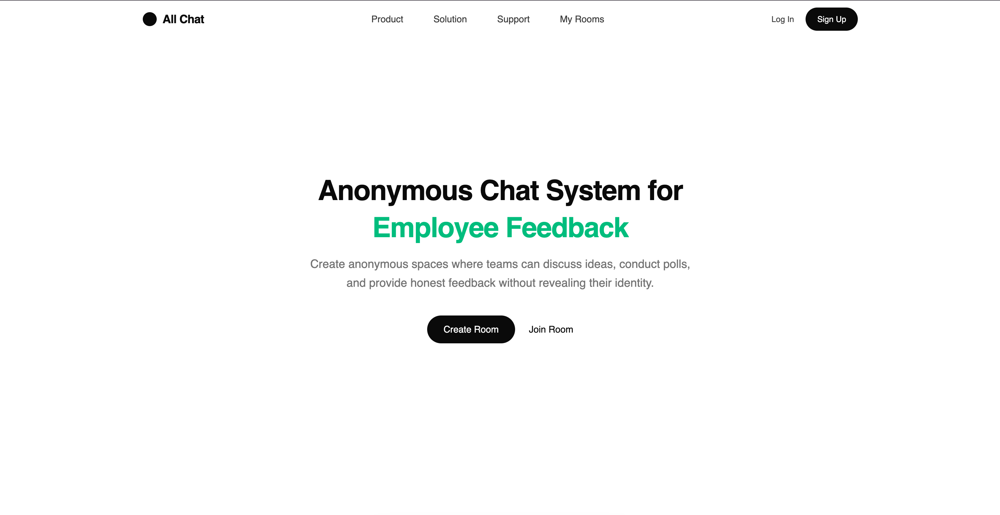

# all-chat

<!-- Add your screenshot/banner below. Drop the file in docs/ and update the path. -->
<p align="center">
  
</p>

**All Chat** is a web-based chat app with a built-in AI assistant. A React
frontend talks to an Express API that streams responses from Google Gemini,
with user data stored in SQLite via Drizzle. It's a TypeScript monorepo.

## Structure

```
all-chat/
├── apps/
│   ├── web/       # React + TanStack Router frontend (AI chat at /ai)
│   └── server/    # Express API (/ai streaming, /users)
└── packages/
    ├── db/        # Drizzle schema & migrations (user table)
    └── ui/        # Shared shadcn/ui components
```

## Getting Started

```bash
pnpm install     # install dependencies
pnpm run db:push # apply the schema to the database
pnpm run dev     # start web + server
```

- Web: http://localhost:3001
- API: http://localhost:3000

## Tech Stack

TypeScript · React · TanStack Router · Express · Drizzle ORM · SQLite · TailwindCSS · shadcn/ui

Scaffolded with [Better-T-Stack](https://github.com/AmanVarshney01/create-better-t-stack).
